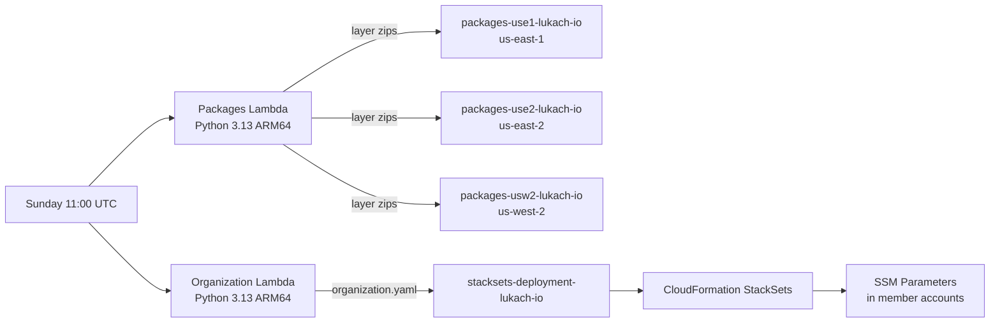

# stacksets

AWS CDK Python app that provides two organization-wide automations and a GitHub Actions OIDC role.

## Stacks

| Stack | Region | Purpose |
|---|---|---|
| `StackSetsBucketUse1` | us-east-1 | S3 bucket `packages-use1-lukach-io` readable by all org accounts |
| `StackSetsBucketUse2` | us-east-2 | S3 bucket `packages-use2-lukach-io` readable by all org accounts |
| `StackSetsBucketUsw2` | us-west-2 | S3 bucket `packages-usw2-lukach-io` readable by all org accounts |
| `StacksetsOrganization` | us-east-2 | Lambda that generates a CloudFormation template with org/account SSM parameters and uploads it to `stacksets-deployment-lukach-io` |
| `StacksetsPackages` | us-east-2 | Lambda that builds Python Lambda layers and uploads them to the three regional buckets |
| `StacksetsStack` | us-east-2 | GitHub Actions OIDC provider and IAM role for CI/CD deployments |

## Lambda Schedules

Both Lambdas run every **Sunday at 11:00 UTC**.

## Published Packages

The packages Lambda builds a Lambda layer zip for each of the following libraries (Python 3.13, ARM64) and uploads it to all three regional buckets:

- `beautifulsoup4`
- `dnspython`
- `fastmcp`
- `geoip2`
- `mangum`
- `maxminddb`
- `netaddr`
- `redis`
- `requests`
- `smart_open[s3]`
- `uv`
- `whoisit`

To add or remove packages, edit `packages/packages.py`.

## Organization Template

The organization Lambda calls AWS Organizations, then writes a CloudFormation template (`organization.yaml`) to `stacksets-deployment-lukach-io`. The template creates SSM parameters:

- `/organization/id` — organization ID
- `/account/<name>` — account ID for each member account

## Prerequisites

- Python 3.x
- AWS CLI configured with a profile named `stack`
- AWS CDK v2 (`npm install -g aws-cdk`)
- IAM permissions for CloudFormation, Lambda, IAM, S3, and Organizations

## Quick Start

1. Clone and install dependencies.

```bash
git clone https://github.com/jblukach/stacksets.git
cd stacksets
pip install -r requirements.txt
```

2. Bootstrap CDK in each target region using the `lukach` qualifier.

```bash
cdk bootstrap --qualifier lukach --profile stack aws://ACCOUNT_ID/us-east-1
cdk bootstrap --qualifier lukach --profile stack aws://ACCOUNT_ID/us-east-2
cdk bootstrap --qualifier lukach --profile stack aws://ACCOUNT_ID/us-west-2
```

3. Deploy all stacks.

```bash
cdk deploy --profile stack --all
```

## Common Commands

```bash
cdk list
cdk diff --profile stack
cdk synth --profile stack
cdk deploy --profile stack --all
cdk destroy --profile stack --all
```

## Project Layout

```text
app.py                              CDK app entry point
cdk.json                            CDK configuration
requirements.txt                    Python dependencies
organization/
  organization.py                   Organization Lambda handler
packages/
  packages.py                       Packages Lambda handler
stacksets/
  stacksets_bucketuse1.py           S3 bucket stack — us-east-1
  stacksets_bucketuse2.py           S3 bucket stack — us-east-2
  stacksets_bucketusw2.py           S3 bucket stack — us-west-2
  stacksets_organization.py         Organization Lambda stack
  stacksets_packages.py             Packages Lambda stack
  stacksets_stack.py                GitHub OIDC role stack
```

## Architecture



## License

See LICENSE.
