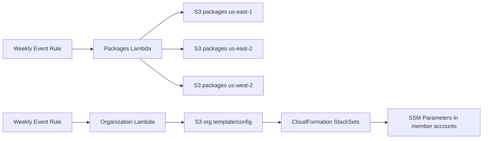

# stacksets

AWS CDK app for two organization-wide automations:

- Package selected Python libraries as Lambda layers and publish them to regional S3 buckets.
- Generate organization/account configuration used by CloudFormation StackSets.

## What This Deploys

- Regional package buckets in:
  - us-east-1
  - us-east-2
  - us-west-2
- A packages Lambda that builds and uploads layer zip files on a weekly schedule.
- An organization Lambda that updates org/account data for StackSet use.
- StackSets and SSM parameters for org-wide configuration.

## Prerequisites

- Python 3.9+
- AWS CLI configured for your target account
- AWS CDK v2
- IAM permissions for CloudFormation, Lambda, IAM, S3, and Organizations

## Quick Start

1. Clone and install dependencies.

```bash
git clone https://github.com/jblukach/stacksets.git
cd stacksets
pip install -r requirements.txt
```

2. Bootstrap CDK environment if needed.

```bash
cdk bootstrap --profile stack
```

3. Review and deploy.

```bash
cdk list
cdk synth
cdk deploy --profile stack --all
```

## Common Commands

```bash
cdk list
cdk diff --profile stack
cdk synth --profile stack
cdk deploy --profile stack --all
cdk destroy --profile stack --all
```

## Project Layout

```text
app.py
organization/organization.py
packages/packages.py
stacksets/stacksets_packages.py
stacksets/stacksets_organization.py
stacksets/stacksets_stack.py
stacksets/stacksets_bucketuse1.py
stacksets/stacksets_bucketuse2.py
stacksets/stacksets_bucketusw2.py
```

## Architecture



## Package Publisher Notes

- The packages Lambda installs dependencies with uv from a Lambda layer.
- Layer zips are uploaded to each regional bucket.
- Schedule is weekly (configured in CDK events rules).

To add or remove published packages, edit `packages/packages.py`.

## Troubleshooting

- If uv fails in Lambda, check CloudWatch logs for:
  - uv executable path
  - uv version
  - uv stderr output for the exact install failure
- If deploy fails on permissions, verify IAM policy coverage for all services above.

## License

See LICENSE.
